# 系统架构

单主线:一条离线实验链路产出一个可部署 artifact,一条在线服务链路按 manifest 绑定并消费它。

```mermaid
flowchart LR
    subgraph OFF[离线实验:单研究问题]
        A[KuaiRand-Pure 原始日志] --> B[确定性5k用户队列 prepare]
        B --> C[时间切分 + 请求桶内先预测后更新]
        C --> D[DeepFM式 / DIN / DIN+MMoE 同协议训练]
        D --> E[验证集GAUC选型 + 随机曝光偏差诊断]
        E --> F[胜出模型 artifact + checkpoint]
    end

    subgraph SRV[在线服务:manifest绑定]
        M[Deployment manifest<br/>5组件 + SHA-256] --> G
        G[ItemCF + 热门/类目召回] --> H[RRF融合去重]
        H --> I[FocusedServingRanker<br/>多目标概率预测]
        I --> J[显式权重 score policy]
        J --> K[多样性约束重排]
        K --> L[recommend API + 前端漏斗]
    end

    F --> M
    L --> N[events 反馈接口]
    N --> O[Kafka / Redpanda]
    O --> P[幂等 feature consumer]
    P --> Q[Redis 在线状态]
    Q --> G
```



## 服务边界

当前 serving bundle 实际运行 ItemCF + popularity 召回、RRF 融合、manifest 绑定的**离线胜出
DeepFM checkpoint**(`FocusedServingRanker`)、identity calibrator 和 diversity reranker。
`/recommend` 同时返回各阶段候选数,前端以漏斗形式展示召回 → 融合 → 精排 → 重排的收敛过程。

重排 score 权重来自显式声明的 `configs/serving_policy.json`(pre-registered),本项目不声称
这些权重经过日志数据上的策略搜索。demo/fallback manifest 绑定 heuristic 模型与合成小目录,
仅用于降级路径与故障演示。

## 版本一致性

一次请求绑定一个不可变 deployment manifest:

```json
{
  "deployment_id": "kuairand-pure-sample-v1",
  "model_version": "focused-deepfm-kuairand-pure-v1",
  "calibrator_version": "identity-kuairand-pure-v1",
  "feature_schema_version": "pit-kuairand-pure-v1",
  "item_index_version": "itemcf-popularity-kuairand-pure-v1",
  "rerank_policy_version": "policy-kuairand-pure-v1",
  "compatibility_key": "kuairand-pure-sample-schema-v1"
}
```

每个 manifest 都绑定五个 component descriptor 的不可变路径和 SHA-256;descriptor 版本、
compatibility key、catalog 与模型 checkpoint 摘要均在启动或激活前校验。激活时先完整验证,
再写入临时文件、fsync,并通过 `os.replace` 原子替换。验证失败时旧 manifest 不变。单次请求
固定使用进程内的不可变 engine;本原型不宣称实现了跨进程无损热重载。

## 降级顺序

1. 主 manifest 的任一 descriptor、摘要、schema 或 catalog 校验失败:加载预先验证的完整
   fallback manifest,并记录 `primary_manifest_load_failed`;
2. 主、fallback 均失败:拒绝启动,避免组件混搭;
3. Redis 模式不可用:拒绝 readiness/启动,不静默切到内存状态;
4. 用户无未看候选:返回空列表并记录 `no_unseen_candidates`,不偷偷放回已看物品。
